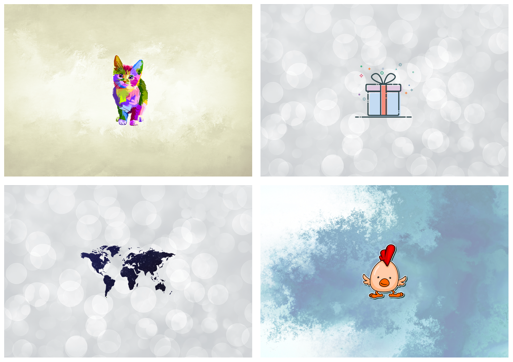
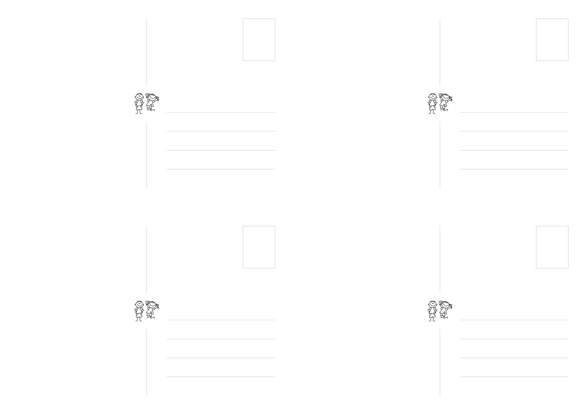

# custom-birtday-cards
Create printable, custom, birthday cards.

# Usage

1. Install PIL.
2. Add icons and backgrounds as PNG or JPEG to the corresponding folders.
3. Set required resolution. E.g. RES = 13 for >300 DPI.
4. Run `python3 main.py`
5. Stitch PNGs to a printable PDF: `convert out/*.png -page a4 -rotate 90 out/output.pdf`

Running `main.py` will create A4 pages with each four birthday cards.
  - One card is generated per icon in the icons folder. 
  - Backgrounds are chosen randomly.
  - To edit the back of the cards, edit card-bg.svg and export as card-bg.png.

# Credits

Images are from various authors on Pixabay.
